# Architecture Flow Diagrams

These diagrams can be rendered using [Mermaid](https://mermaid.js.org/) or pasted into tools like [Mermaid Live Editor](https://mermaid.live/).

---

## Sequence Diagram: End-to-End Flow

---

## Flowchart: Pipeline Decision Logic

---

## Component Architecture Diagram

```mermaid
graph TB
    subgraph Slack["☁️ Slack Cloud"]
        Event[Message Event]
        Reply[Threaded Reply]
    end
    
    subgraph Process1["🔌 Process 1: Socket Listener"]
        SocketMode[Socket Mode Handler]
        Validator[Event Validator]
        URLExtractor[URL Extractor]
    end
    
    subgraph Database["🗄️ SQLite Database"]
        JobsTable[(jobs table)]
    end
    
    subgraph Process2["⚙️ Process 2: Job Worker"]
        Poller[Job Poller]
        PipelineRunner[Pipeline Runner]
    end
    
    subgraph Pipeline["📦 5-Stage Pipeline"]
        S1[Stage 1: URL Extraction]
        S2[Stage 2: Content Retrieval<br/>httpx + trafilatura]
        S3[Stage 3: LLM Analysis<br/>GPT-4o]
        S4[Stage 4: Quality Gates<br/>Pydantic validation]
        S5[Stage 5: Slack Posting<br/>Block Kit]
    end
    
    subgraph External["🌐 External Services"]
        OpenAI[OpenAI API]
        Web[Web Content]
    end
    
    Event -->|WebSocket| SocketMode
    SocketMode --> Validator
    Validator --> URLExtractor
    URLExtractor -->|INSERT| JobsTable
    
    JobsTable -->|Poll every 5s| Poller
    Poller -->|Claim job| PipelineRunner
    
    PipelineRunner --> S1
    S1 --> S2
    S2 -.->|HTTP GET| Web
    S2 --> S3
    S3 -.->|API Call| OpenAI
    S3 --> S4
    S4 --> S5
    S5 -->|POST| Reply
    
    S5 -->|UPDATE status| JobsTable
    
    style Process1 fill:#e3f2fd
    style Process2 fill:#f3e5f5
    style Pipeline fill:#fff3e0
    style Database fill:#e8f5e9
    style Slack fill:#fce4ec
    style External fill:#f5f5f5
```

---

## Data Flow: Stage 2 Content Retrieval

---

## State Machine: Job Lifecycle

---

## Usage

### For Google Slides:
1. Copy any Mermaid diagram above
2. Use [Mermaid Live Editor](https://mermaid.live/) to render as PNG/SVG
3. Download and insert into slides

### For Markdown Presentations (reveal.js, Marp):
Just paste the Mermaid code blocks directly - they'll auto-render

### For Documentation:
GitHub, GitLab, and many tools render Mermaid natively
